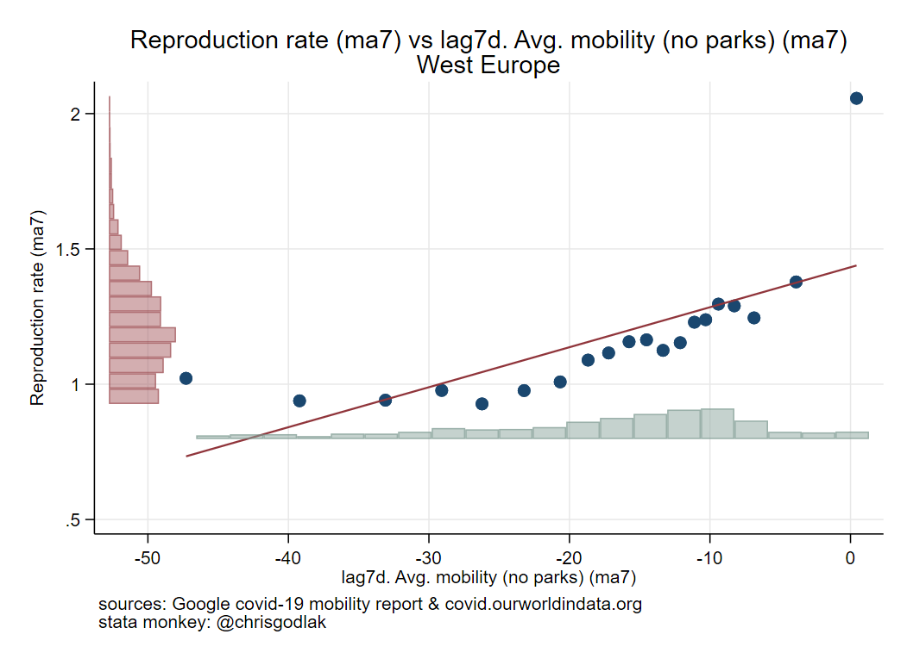
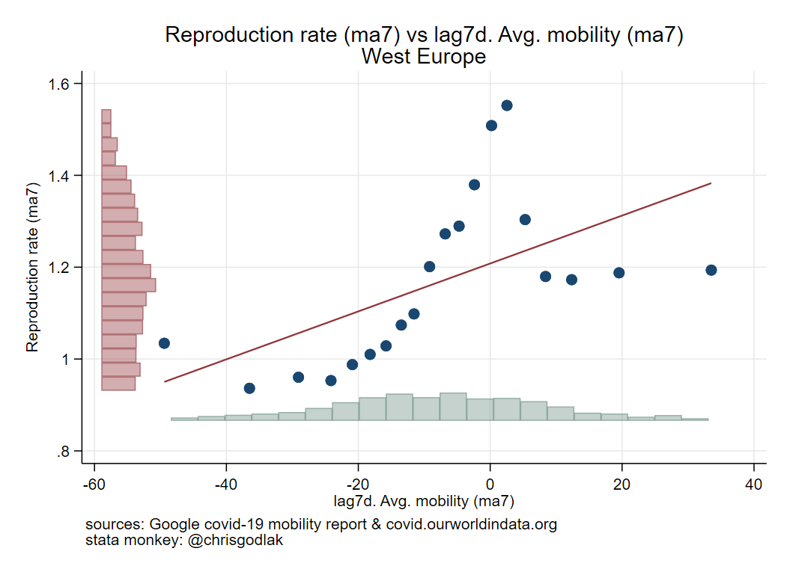

All bin scatter plots with histograms
========================

<!--- To create a heading, we underline text with equal signs. -->

<!--- Text enclosed in these arrows will be ignored. -->

This page provides all the graphics of bin scatter plots with histograms
---

<!--- The three dashes above create a horizontal line. -->

### Graphics

<!--- We create a sub-heading with two pound signs. -->

<!--- We use two asterisks around each word we want to format as bold. -->

**Graphs**

